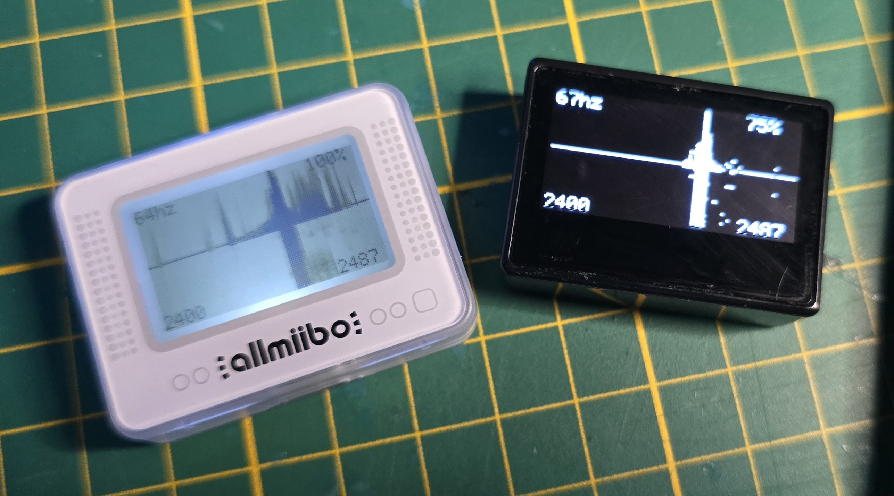

# ATC1441 pixlAnalyzer

Simple 2.4GHz Spectrum Analyzer based on the nRF52832 in the PixlJs allmiibo emulator

This Firmware is currently compatible with the LCD and OLED variant you can get on Aliexpress for around 10-15€ it will make it a very simple battery powered 2400 - 2487MHz Spectrum Analyzer with a Waterfall like history show with little options.

This repo is made together with this explanation video:(click on it)

Find them on Aliexpress as example here:

https://aliexpress.com/item/1005008726926205.html

## Flashing

You can flash this firmware fully OTA and go back to the stock Pixl.js firmware as well.
Navigate to the Pixl.js firmware settings and enter the "Firmware Update" menu
The device will reboot and show "DFU Update" now use the nRFConnect App to connect to the "Pixl DFU" device showing.
Select the correct firmware update file "PixlAnalyzerLCD.zip" or "PixlAnalyzerOLED.zip" depending on your device and it will flash and reboot to the new Firmware.

To Go back to the Pixl.js firmware you can open the menu by pressing the middle button, then navigate to "DFU" and flash the Stock firmware in the same way again.

## Compiling

Its made to be used with Windows right now some changes will be needed to make it Linux compatible.
You need to have make and gcc-arm-none-eabi installed and working.

The gcc-arm-none-eabi path needs to be set in the Makefile.windows in the SDK folder (search for it)

## Credits

Credit goes to this repo for the codebase and pinout etc.:

https://github.com/solosky/pixl.js/

## Future Work / Ideas

See [ideas](ideas.md) for more details.
